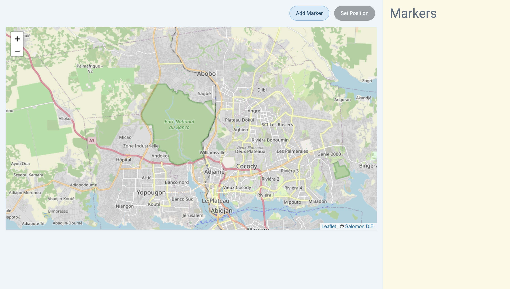
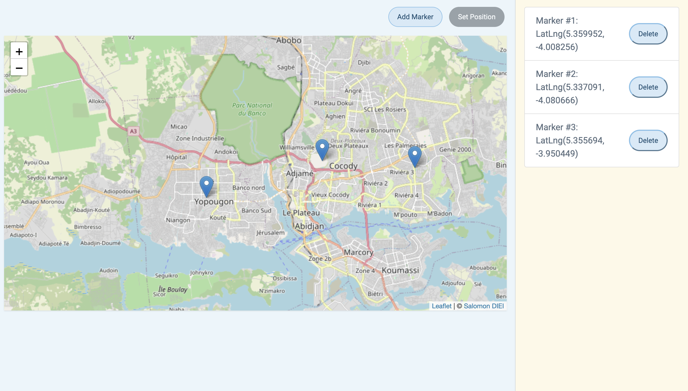

# Interactive Map Application

This is an interactive map application built using Leaflet, a powerful open-source JavaScript library for mobile-friendly interactive maps. The application has several interactive features such as adding markers, fixing marker positions, and deleting markers all in a user-friendly interface powered by Bootstrap.

## Features

- **Add Marker:** Enables users to add a new marker on the map.
- **Set Position:** Once a marker is added, users have the option to fix its position on the map. Once the position is set, it can't be moved anymore.
- **Display Coordinates:** Once a marker's position is set, users can click on the marker to display a popup that has information on the coordinates of the marker. The popup will show the latitude and longitude of the marker's fixed position.
- **Delete Markers:** Any marker added on the map can be deleted using a ‘Delete’ button from a side panel.
- **Side Panel:** The side panel displays a list of all the added markers with their coordinates, along with a delete button for each marker.

## Screenshots

## Getting Started

### Prerequisites

- A web browser (Chrome, Firefox, Safari, etc.)

### Installation 

No installation required. You can use the web application directly.

1. Clone the repository or download the code.
2. Enter in the src folder
3. Open the `index.html` file in your browser.

## Usage

1. Click on the "Add Marker" button to add a new marker to the map. The new marker will appear on the map and in the side panel with its coordinates.
2. You can drag the new marker to adjust its position. If you want to fix its position, click on the "Set Position" button.
3. In the side panel, each marker comes with a "Delete" button. Click on this button to remove the marker from the map and the panel.

## Built With

- Leaflet - The JavaScript library for interactive maps.
- Bootstrap - The framework used for building the user interface.

## Author

- **Salomon DIEI**: Software Engineer

## Acknowledgments 

The map data is provided by OpenStreetMap contributors.
